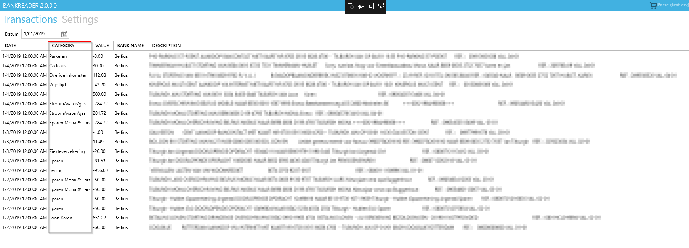

# BankReader

This library will process export files from your bank and will categorize each of the lines based on the configures expressions. The idea for this library is that you can load these files and set categories for most of the lines and after that import it into your spreadsheet application.

# Supported banks

Currently the library supports the following (belgian) banks:

- Belfius
- Argenta

# UI

For now the only UI available is a WPF application. So in the you can select an exported file from any of the supported banks. After processing this file you will have a table which looks like this:



The category column the part which is set using this library.

# Add new categories or rules

1. Create a file under the `Categories` folder and give it the `.json` extension.
2. Add a JSON array to the file:

```JSON
    [
        {
            "Category": "<NAMEOFTHECATEGORY>",
            "StringExpression": "<EXPRESSIONTOMATCHTHISCATEGORY>"
        }
    ]
```

| Name                          | Description                                                                                                                  |
| :---------------------------- | :--------------------------------------------------------------------------------------------------------------------------- |
| NAMEOFTHECATEGORY             | The category to which the expression belongs, this can be any string you want.                                               |
| EXPRESSIONTOMATCHTHISCATEGORY | Expression to do match with. This is a C# string expression and the variable name passed to the expression is `description`. |

You can use any C# string expression in the `StringExpression` property. The application will pass in the description using the `description` variable. This is also the one which you need to use to build the expression. An example of an expression could be as following:

```JSON
    description.Contains(\"aldi\") || description.Contains(\"lidl\")
```

So the above expression will match any line from the exported file which contains `aldi` or `lidl`.
